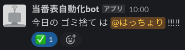

# rota-notification
Automated duty roster notification



<br>

## Workflow
Google Spreadsheet -> Slack

1. Get a rota from Google Drive using Google spreadsheet API
2. Notify 

<br>

Scheduling Cron jobs with Crontab

```
55 9 * * 1,2,3,4,5 /home/hattori/anaconda3/bin/conda activate slack-bot; /home/hattori/anaconda3/envs/slack-bot/bin/python /home/hattori/sandbox/rota-notification/slack_bot.py
```

